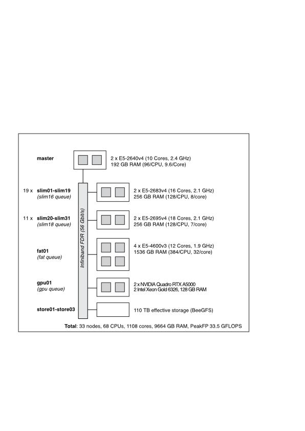

# bmc-HPC Handbook

Welcome to the BMC HPC. 

First things first: Your user account will be deleted together with all files on the fast file system (mount point /work) as soon as you can no longer be reached by e-mail (address used when applying for the account). There will be no warnings, it will happen.

## Cluster layout

### Internet connection

Only the master node has connection to the outside world. Jobs running on computation nodes cannot access internet resources. If you want to parallely process samples from resources such as SRA/ENA, you have to first download all data on the master node. Processing of the downloaded data is subsequently and paralelly done on computation nodes.

## Cluster login

Connection to the master node is only possible via **ssh**. An LRZ **VPN** tunnel ([https://www.lrz.de/services/netz/mobil/vpn_en/](https://doku.lrz.de/display/PUBLIC/VPN+-+eduVPN+-+Installation+und+Konfiguration)) has to be used in case of client being located outside the BMC. You have to choose the **"Full-Tunnel"** in eduVPN profile to connect. 

How to connect without having to provide a password every time:  <https://www.tecmint.com/ssh-passwordless-login-using-ssh-keygen-in-5-easy-steps/>

## OS

Operating system: CentOS Linux

## Software
### Module system

Bioinformatics software is made available to the cluster using the Linux module environment. I.e. the executables are nor in your PATH by default, instead they have to be explicitly acitvated. This has to happen on both the master and the computation nodes. A major advantage of such a system is the co-existence of different versions of the same software. 

more info here: <http://modules.sourceforge.net>

available packages are listed using
  
    > module avail
    ------------------------ /usr/share/Modules/modulefiles ------------------------
    dot         module-git  module-info modules     null        use.own
    
    ---------------------------- /opt/software/modules -----------------------------
    aspera/3.6.2              ngs/DFilter/1.6           ngs/samtools/0.1.20
    ghostscript/9.20          ngs/ea-utils/1.04.807     ngs/samtools/1.3.1
    meme/4.11.4(default)      ngs/FastQC/0.11.5         ngs/samtools/1.8
    mpi/gcc/mvapich2/2.1      ngs/FastQC/0.11.7         ngs/seqtk/1.2
    mpi/gcc/open-mpi/2.0.0    ngs/fastx_toolkit/0.0.14  ngs/sratoolkit/2.7.0
    ncbi-blast/2.7.1+         ngs/freebayes/1.2.0       ngs/sratoolkit/2.8.0
    ngs/bamtools/2.5.1        ngs/gmap/2017-09-11       ngs/STAR/2.5.2a
    ngs/bcl2fastq2/2.20.0.422 ngs/HaPCUT2/0.0           ngs/STAR/2.5.3a
    ngs/bedtools2/2.26.0      ngs/HiC-Pro/2.9.0         ngs/STAR/2.6.0a
    ngs/bedtools2/2.27.1      ngs/hisat2/2.0.4          ngs/subread/1.4.6
    ngs/bismark/0.18.1        ngs/Homer/4.8             ngs/subread/1.6.2
    ngs/bowtie1/1.1.2         ngs/Homer/4.9             ngs/tophat/2.1.1
    ngs/bowtie2/2.2.9         ngs/Je/1.2                ngs/Trinity/2.4.0
    ngs/bwa/0.7.16            ngs/kallisto/0.43.0       ngs/UCSCutils/3.4.1
    ngs/cellranger/2.1.1      ngs/kallisto/0.44.0       ngs/weblogo/2.8.2
    ngs/cluster/1.52a         ngs/minimap2/2.10         ngs/WiggleTools/1.2.2
    ngs/cufflinks/2.2.1       ngs/mummer/4.0.0beta2     python/3.6
    ngs/cutadapt/1.16         ngs/RSEM/1.2.31           R/3.3.1
    ngs/cutadapt/1.4.1        ngs/RSEM/1.3.0            R/3.4.1(default)
    ngs/cutadapt/1.9.1        ngs/Salmon/0.9.1          R/3.5.0
   
  specific packages are loaded using  
  
    > module load ngs/RSEM/1.2.31

### Private software installs - Conda

In addition to the executables provided by the module system, you can of course install software privately, i.e. in one of your directories. A very convenient way for keeping private installs organized is Conda. If you want to create reproducible pipelines, Conda is actually preferred to modules. Miniconda (<https://docs.conda.io/en/latest/miniconda.html>) is the preferred package for private installation on the cluster. 

### R

R packages have to be installed into private repositories. In other words, the users are responsible for keeping track on their R libraries. Installation into private repositories will happen by default upon calling `install.packages`. Please make sure that you purge your repository if you switch R version.

## SLURM

Data processing should exclusively performed on computation nodes using the SLURM job scheduler. For a simple introduction see <https://github.com/bmc-CompBio/SLURM>

## Jupyter Notebook

Instructions on how to run Jupyter Notebook on the cluster can be found here <https://github.com/bmc-CompBio/HPC_doc/blob/master/jupyter_notebook.md>

## Data storage
 
A fast file system is mounted on all nodes (/work). The project directories located in here (`/work/projects/`) are the primary location for private data storage.  **Do not use the home directory on the master node (` ~/.` ) for storing data**. If you fetch data from SRA make sure the cache directory is placed in your project directory on the fast file system and not in your home directory which will be set by default (<https://github.com/ncbi/sra-tools/wiki/Toolkit-Configuration>).

There is **no backup** system for the data stored on the cluster. Furthermore, in case of emergency, all your files might be deleted, make sure that you always have local copies of your data.  

## File transfer

options are `scp` on all linux/unix , mounting the cluster volume on the client with `sshfs` on OSX.

## Etiquette
### Saving disk space
 
Only files, which are part of active processing schemes should be stored on the cluster. At present users are supposed not to exceed 2 TB disc space. 
 
#### How much disk space do I occupy? 
go the the directory of interest and issue
    
    >  du -sh .
    
On a long term basis this should not be more than 100 GB in your /work/project/XXX directory.
 
#### Compress fastq and similar (bed, wiggle..)  files 
 
 Open an interactive SLURM session and parallely gzip compress all files with defined ending 
 
     > srun -p slim18 -I -c 36 --pty /bin/bash
     > CORES=$(grep -c '^processor' /proc/cpuinfo)
     > find . -type f -name '*.fastq' -print0 | xargs -0 -n 1 -P $CORES gzip
 
#### Purge the SRA cache directory

 Run `cache-mgr -c` to empty your ncbi/sra directory 
 
### Running jobs

If you repeatedly run the same batch scripts on a huge number of samples, make sure the resource allocation is appropriate. I.e., don't request more RAM than needed. You can check the true requirements by running a single job and executing `sacct -j <job-id> --format="ReqMem,AllocCPUs,MaxRSS,Elapsed"` after completion.

## Acknowledging the facility

If you used the cluster for processing data in a study you are going to publish, you are expected to acknowledge the Bioinformatic Core Facility in the manuscript. Repeated  failure to do so will have the group/user stripped off cluster access.
